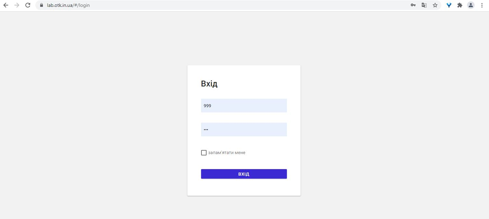

# Вход и авторизация

## Как войти в кабинет лаборатории?

Для того, чтобы войти в кабинет лаборатории, необходимо:
1.	Открыть браузер, например, Google Chrome.
2.	В адресной строке браузера набрать адрес кабинета лаборатории https://lab.otk.in.ua/ и нажать клавишу "Enter". Откроется окно Входа в систему.
3.	Ввести имя пользователя и пароль, нажать кнопку «Войти».

 В результате откроется стартовая страница кабинета лаборатории - «Головна»:

 

**Внимание!**
Если на одном компьютере ведется учет по двум (или больше) лабораториям, то для разных лабораторий кабинет лаборатории должен открываться в различных браузерах (Google Chrome, Opera, Firefox, Internet Explorer).

***

## Где взять имя пользователя и пароль?

Пароль выдает IT-отдел.

*** 

## Можно ли поменять пароль?

Нет, пароль поменять нельзя.

***

## Как обновить версию Кабинета лаборатории?

Для того, чтобы обновить версию программного комплекса «Кабінет лабораторії», необходимо нажать на кнопку  в верхнем правом углу.

 

